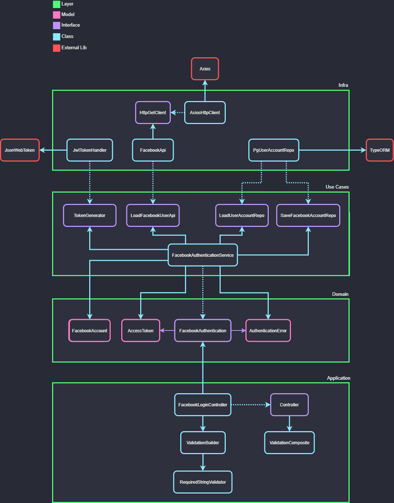

## Up & Running

1. Install local dependencies:

```terminal
npm install
```

2. Tests run with sufix unit or integration depending on what will be tested:

```terminal
npm test:unit
npm test:integration
```

## Scripts


| Script                        | Description                                                   |
| ----------------------------- | ------------------------------------------------------------- |
| `npm run start`               | Run production server                                         |
| `npm run debug`               | Run dev server                                                |
| `npm run build`               | Generates production build                                    |
| `npm run build:watch`         | Run unit tests in watch mode                                  |
| `npm run up`                  | Run container with development env                            |
| `npm run down`                | Stop containers                                               |
| `npm run test`                | Run all tests                                                 |
| `npm run test:unit`           | Run unit tests                                                |
| `npm run test:integration`    | Run integration tests                                         |
| `npm run test:staged`         | Run unit and integration tests once (great to be used in CI)  |
| `npm run test:ci`             | Run Covererage test (great to be used in CD)                  |
| `npm run test:coveralls`      | Run coveralls to publish coverage                             |

## Tree structure

This project uses Clean Architecture and some ideas from Domain Driven Desing with Object Oriented Programming.

### Layer Diagram


### Dependencies Diagram



### Folder Structure

```terminal
.
├── src
│   ├── domain
│   │   ├── contracts
│   │   ├── entities
│   │   ├── errors
│   │   └── use-cases
│   ├── infra
│   │   ├── apis
│   │   ├── crypto
│   │   ├── http
│   │   └── postgres
│   ├── application
│   │   ├── controllers
│   │   ├── errors
│   │   ├── helpers
│   │   └──  validation
│   ├── main
│   │   ├── adapters
│   │   ├── config
│   │   ├── factories
│   │   ├── routes
│   │   └── index.ts
├── tests
```


| Directory / File             | Description                                                                                                                    |
| ---------------------------- | ------------------------------------------------------------------------------------------------------------------------------ |
| `src`                        | All source code write in TypeScript must be in this directory                                                                  |
| `tests`                      | All test files must be in this directory                                                                                       |
| `src/main/index.ts`         | Main entry point for initial configuration of the project. .                 |
| `src/main/config/env.ts`     | List of Environment Variables.                                                                                                 |
| `jest-integration-config.js` | Jest configuration file for integration tests                                                                                  |
| `jest-unit-config.js`        | Jest configuration file for unit tests                                                                                         |
| `jest.config.js`             | Main Jest configuration file                                                                                                   |

## Important usage information

### Developer workflow

From Clean Architecture recommendations, there is a layer order to develop. The rule is:

1. Domain
 - 1.1 entities
 - 1.2 contracts
 - 1.3 usecases
 - 1.4 errors
3. Infra
4. Application
6. Main
 - 6.1 adapters routes
 - 6.2 factories controllers
 - 6.3 factories usecases
 - 6.4 adapters
 - 6.4 config

### Environment Variables

Just put all your env vars on file `src/main/config/env.ts`.

### Global import

All files and dirs inside `src` directory can be imported using `@/`.
Prefer using this way over local import (`../../`).

## License

MIT